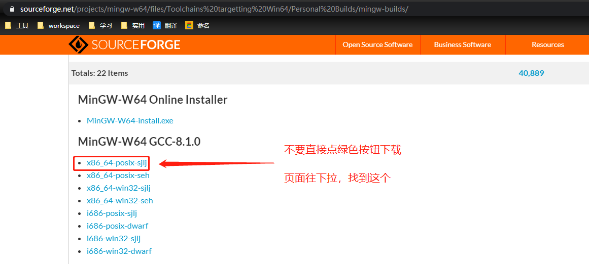

# C开发环境搭建-CentOS

## Install
- `yum install gcc`
- `yum install gcc-c++`

## Hello World

- `vim hello.c`

    ```c
    #include <stdio.h>

    int main() {
        printf("Hello World !");
    }
    ```

- `gcc hello.c -o hello`

## 错误处理

未安装 `g++` 可能会报错 `gcc: error trying to exec 'cc1plus': execvp: No such file or directory`

`yum install gcc-c++`

---

# C开发环境搭建-Windows
- IDE：VS Code
- Plugin：C/C++、Code Runner
- 运行环境：MinGW

## Install MinGW

- [mingw-w64](https://sourceforge.net/projects/mingw-w64/files/Toolchains%20targetting%20Win64/Personal%20Builds/mingw-builds/)

- 

## 配置环境变量

环境变量`PATH`中添加`E:\app_res\mingw64\bin`

测试一下：
`g++ --version`
`gcc --version`

---

## C 与 C++
### `gcc` 和 `g++` 的区别

- gcc: GNU C Compiler

- g++: GNU C++ Compiler

### `.c` 后缀和 `.cpp` 后缀的区别

- `.c` C程序
- `.cpp` C++程序

### 使用 `printf` 时导入标准库

- C：`#include <stdio.h>`
- C++：`#include <cstdio>`